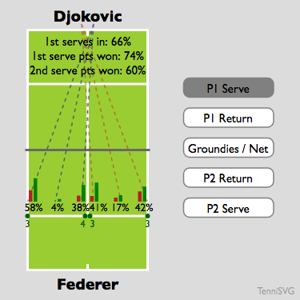
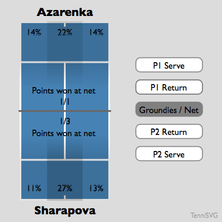

# TenniSVG

## What is it?

A way of displaying tennis match statistics on an SVG graphic, powered by a JSON data source.

  

## Why?

All the tennis coverage on TV has cool infographics, whereas on the internet the stats are usually text-based and there's no standard. We want to build a cool, open, accessible infographic format for anyone to use!

## How?

By reading statistical data in JSON format and using JavaScript to insert the values into placeholders in the SVG court template. Some statistics (serve points won/lost) are displayed as mini histograms; others (groundstroke distribution) as density maps.

As a data source I have been using the [Match Charting Project](http://www.tennisabstract.com/charting/).

## What statistics are supported?

* 1st serve percentage
* 1st & 2nd serve points won percentage
* Serve direction (wide, centre, T on each side)
* Ace count in each direction
* Returns in play %, return points won
* Return depth distribution
* Groundstroke depth/width distribution (3x3 zones on the court)
* Net points won/played
* Surface, as the background colour of the graphic!

## What is not yet supported?

* Match breakdown by sets
* Winners/errors off each wing
* Doubles matches

## Project status

The project is in early development. The code could still use a lot of work to be honest; it is rather inflexible.

## Contributing

Contributions are welcome! Please [open an issue](issues/) or [make a PR](pulls/) or simply send me a message:

#### Ideas

* Scraping the raw statistics from somewhere
* Standardising the JSON format ([current format](jsonguide.html))
* Making the visualisations more modular and reusable

## License

This project is licensed under the MIT License.
